# Диаграммы архитектуры системы

## C4 Model - Level 1: System Context

```mermaid
graph TB
    User[👤 Пользователь] --> Bot[📱 Telegram Bot]
    Admin[👨‍💼 Администратор] --> Dashboard[🖥️ Web Dashboard]
    Bot --> System[🏢 Система аналитики и рекомендаций]
    Dashboard --> System
    System --> DB[(🗄️ PostgreSQL)]
    System --> ML[🤖 ML Services]
```

## C4 Model - Level 2: Container Diagram

## C4 Model - Level 3: Component Diagram (Backend API)

## Data Flow Diagram

```mermaid
graph LR
    subgraph "Data Sources"
        Historical[📊 Исторические данные]
        BotEvents[🤖 События от бота]
        UserActions[👤 Действия пользователей]
    end
    
    subgraph "ETL Process"
        ETL[🔄 ETL Pipeline]
        Validation[✅ Валидация данных]
    end
    
    subgraph "Data Storage"
        RawData[(📋 Сырые данные)]
        ProcessedData[(⚡ Обработанные данные)]
    end
    
    subgraph "ML Pipeline"
        FeatureEng[🔧 Feature Engineering]
        ModelTraining[🎯 Обучение моделей]
        Predictions[🔮 Прогнозы]
    end
    
    subgraph "Applications"
        Dashboard[🖥️ Dashboard]
        Bot[📱 Bot]
        API[🔌 API]
    end
    
    Historical --> ETL
    BotEvents --> ETL
    UserActions --> ETL
    ETL --> Validation
    Validation --> RawData
    RawData --> FeatureEng
    FeatureEng --> ProcessedData
    ProcessedData --> ModelTraining
    ModelTraining --> Predictions
    Predictions --> Dashboard
    Predictions --> Bot
    Predictions --> API
```

## ML Pipeline Architecture

## API Architecture

```mermaid
graph TB
    subgraph "API Gateway"
        Gateway[🌐 API Gateway<br/>Rate Limiting, Auth, CORS]
    end
    
    subgraph "Authentication"
        JWT[🔐 JWT Token Service]
        AuthMiddleware[🛡️ Auth Middleware]
    end
    
    subgraph "API Endpoints"
        UserAPI[👤 User API]
        AnalyticsAPI[📊 Analytics API]
        MLAPI[🤖 ML API]
        BotAPI[📱 Bot API]
    end
    
    subgraph "Business Logic"
        UserService[👤 User Service]
        AnalyticsService[📊 Analytics Service]
        MLService[🤖 ML Service]
        BotService[📱 Bot Service]
    end
    
    subgraph "Data Access"
        UserRepo[👤 User Repository]
        AnalyticsRepo[📊 Analytics Repository]
        MLRepo[🤖 ML Repository]
    end
    
    Gateway --> JWT
    Gateway --> AuthMiddleware
    AuthMiddleware --> UserAPI
    AuthMiddleware --> AnalyticsAPI
    AuthMiddleware --> MLAPI
    AuthMiddleware --> BotAPI
    
    UserAPI --> UserService
    AnalyticsAPI --> AnalyticsService
    MLAPI --> MLService
    BotAPI --> BotService
    
    UserService --> UserRepo
    AnalyticsService --> AnalyticsRepo
    MLService --> MLRepo
```

## Database Schema Relationships

