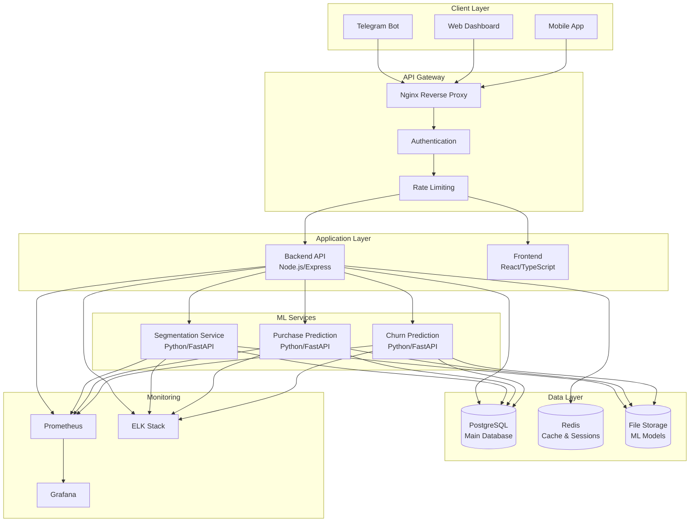
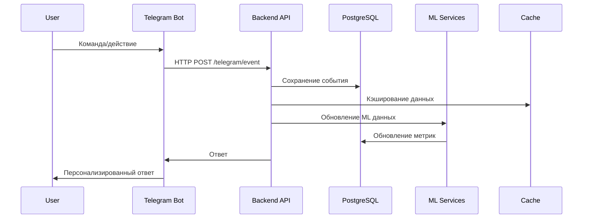
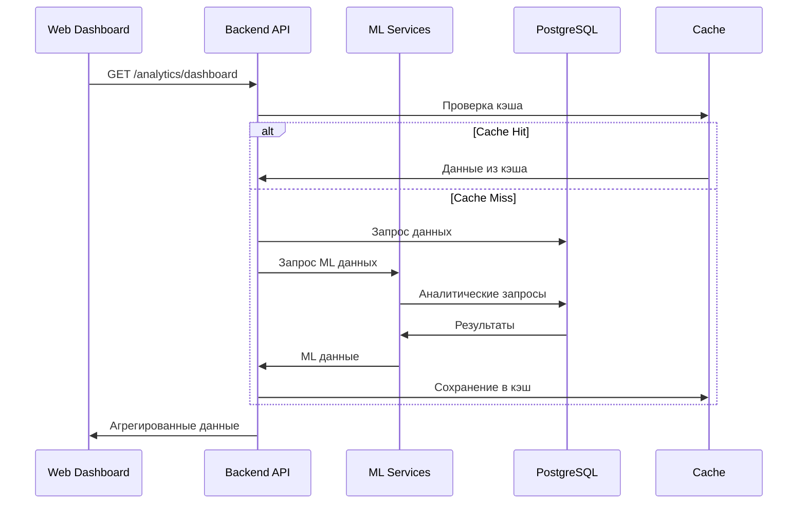
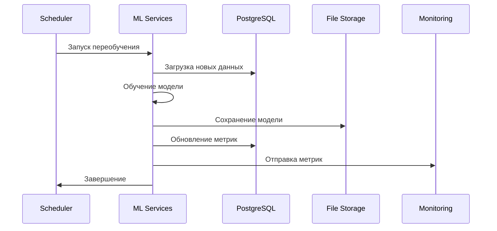

# Системная архитектура Customer Analyzer

## Обзор

Customer Analyzer - это комплексная система аналитики пользователей, построенная на микросервисной архитектуре с использованием современных технологий машинного обучения.

## Архитектурные принципы

- **Микросервисная архитектура**: Разделение на независимые сервисы
- **Event-driven**: Обработка событий в реальном времени
- **API-first**: Все взаимодействие через REST API
- **Data-driven**: Принятие решений на основе данных
- **Scalable**: Горизонтальное и вертикальное масштабирование
- **Secure**: Безопасность на всех уровнях

## Высокоуровневая архитектура

## Компоненты системы

### 1. Client Layer (Клиентский слой)

#### Telegram Bot
- **Технология**: node-telegram-bot-api
- **Функции**:
  - Обработка команд пользователей
  - Отправка уведомлений
  - Персонализированные рекомендации
  - Обратная связь с пользователями

#### Web Dashboard
- **Технология**: React + TypeScript + Material-UI
- **Функции**:
  - Визуализация аналитических данных
  - Управление пользователями
  - Мониторинг ML моделей
  - Настройка системы

#### Mobile App (Планируется)
- **Технология**: React Native
- **Функции**:
  - Мобильный доступ к дашборду
  - Push уведомления
  - Офлайн режим

### 2. API Gateway

#### Nginx Reverse Proxy
- **Функции**:
  - Маршрутизация запросов
  - SSL termination
  - Load balancing
  - Rate limiting
  - Caching

#### Authentication & Authorization
- **JWT токены** для API аутентификации
- **API ключи** для сервисного взаимодействия
- **Role-based access control**

### 3. Application Layer

#### Backend API Service
- **Технология**: Node.js + Express + TypeScript
- **Функции**:
  - Управление пользователями и событиями
  - Интеграция с Telegram Bot
  - API для фронтенда
  - Обработка бизнес-логики

#### Frontend Service
- **Технология**: React + TypeScript + Material-UI
- **Функции**:
  - Пользовательский интерфейс
  - Визуализация данных
  - Управление состоянием
  - Интеграция с Backend API

### 4. ML Services Layer

#### User Segmentation Service
- **Технология**: Python + FastAPI + scikit-learn
- **Функции**:
  - Кластеризация пользователей
  - Анализ поведенческих паттернов
  - Определение сегментов
  - Обновление сегментации

#### Purchase Prediction Service
- **Технология**: Python + FastAPI + XGBoost
- **Функции**:
  - Прогнозирование покупок
  - Анализ вероятности конверсии
  - Рекомендации по таргетингу
  - Обновление прогнозов

#### Churn Prediction Service
- **Технология**: Python + FastAPI + Ensemble Methods
- **Функции**:
  - Прогнозирование оттока
  - Анализ факторов риска
  - Рекомендации по удержанию
  - Раннее предупреждение

### 5. Data Layer

#### PostgreSQL Database
- **Функции**:
  - Хранение пользовательских данных
  - Хранение событий и метрик
  - Аналитические запросы
  - ACID транзакции

#### Redis Cache
- **Функции**:
  - Кэширование API ответов
  - Сессии пользователей
  - Временные данные
  - Rate limiting

#### File Storage
- **Функции**:
  - Хранение ML моделей
  - Логи и отчеты
  - Backup данные
  - Конфигурации

### 6. Monitoring & Observability

#### Prometheus
- **Функции**:
  - Сбор метрик
  - Мониторинг производительности
  - Алертинг
  - Исторические данные

#### Grafana
- **Функции**:
  - Визуализация метрик
  - Дашборды
  - Анализ трендов
  - Отчеты

#### ELK Stack
- **Функции**:
  - Централизованное логирование
  - Поиск по логам
  - Анализ ошибок
  - Мониторинг безопасности

## Потоки данных

### 1. Поток событий пользователей

### 2. Поток аналитических запросов

### 3. Поток переобучения ML моделей

## Безопасность

### 1. Аутентификация и авторизация

- **JWT токены** с коротким временем жизни
- **Refresh токены** для продления сессий
- **API ключи** для сервисного взаимодействия
- **Role-based access control** (RBAC)

### 2. Сетевая безопасность

- **HTTPS** для всех внешних соединений
- **VPN** для доступа к внутренним сервисам
- **Firewall** на уровне сети
- **Rate limiting** для предотвращения DDoS

### 3. Безопасность данных

- **Шифрование** данных в покое и при передаче
- **Хеширование** паролей с salt
- **Secrets management** для конфиденциальных данных
- **Audit logging** всех операций

### 4. Безопасность приложений

- **Input validation** на всех уровнях
- **SQL injection** защита
- **XSS** защита
- **CSRF** защита

## Масштабирование

### 1. Горизонтальное масштабирование

- **Load balancing** на уровне Nginx
- **Stateless services** для легкого масштабирования
- **Database sharding** при необходимости
- **Microservices** независимое масштабирование

### 2. Вертикальное масштабирование

- **Resource limits** в Docker
- **Auto-scaling** на основе метрик
- **Connection pooling** для БД
- **Caching** для снижения нагрузки

### 3. Масштабирование данных

- **Read replicas** для PostgreSQL
- **Partitioning** больших таблиц
- **Data archiving** старых данных
- **CDN** для статических ресурсов

## Производительность

### 1. Оптимизация запросов

- **Database indexing** для быстрых запросов
- **Query optimization** и анализ планов
- **Connection pooling** для эффективного использования соединений
- **Prepared statements** для повторяющихся запросов

### 2. Кэширование

- **Redis** для кэширования API ответов
- **Application-level caching** для часто используемых данных
- **CDN** для статических ресурсов
- **Browser caching** для клиентских ресурсов

### 3. Асинхронная обработка

- **Background jobs** для тяжелых операций
- **Message queues** для обработки событий
- **Event streaming** для real-time обновлений
- **Batch processing** для ML операций

## Мониторинг и наблюдаемость

### 1. Метрики

- **Application metrics**: Время ответа, ошибки, throughput
- **Infrastructure metrics**: CPU, память, диск, сеть
- **Business metrics**: Конверсия, активность, доход
- **ML metrics**: Точность моделей, дрифт данных

### 2. Логирование

- **Structured logging** в JSON формате
- **Centralized logging** через ELK Stack
- **Log aggregation** и анализ
- **Error tracking** и alerting

### 3. Трассировка

- **Distributed tracing** для микросервисов
- **Performance monitoring** и профилирование
- **Dependency mapping** и анализ
- **Latency analysis** и оптимизация

## Развертывание

### 1. Контейнеризация

- **Docker** для всех сервисов
- **Multi-stage builds** для оптимизации образов
- **Health checks** для проверки состояния
- **Resource limits** для контроля ресурсов

### 2. Оркестрация

- **Docker Compose** для локальной разработки
- **Kubernetes** для production (планируется)
- **Service discovery** и load balancing
- **Rolling deployments** для zero-downtime обновлений

### 3. CI/CD

- **GitHub Actions** для автоматизации
- **Automated testing** на каждом коммите
- **Security scanning** зависимостей
- **Automated deployment** в staging и production

## Резервное копирование и восстановление

### 1. База данных

- **Daily backups** PostgreSQL
- **Point-in-time recovery** для критических данных
- **Cross-region replication** для disaster recovery
- **Automated backup testing** и восстановление

### 2. Конфигурация

- **Infrastructure as Code** для воспроизводимости
- **Configuration management** и версионирование
- **Secrets management** и ротация
- **Environment parity** между средами

### 3. Мониторинг

- **Backup monitoring** и алерты
- **Recovery testing** и документация
- **Disaster recovery** планы и процедуры
- **Business continuity** и RTO/RPO цели

## Будущие улучшения

### 1. Технологические

- **Kubernetes** для production оркестрации
- **Service mesh** (Istio) для управления трафиком
- **Event streaming** (Apache Kafka) для real-time обработки
- **GraphQL** для более эффективных API запросов

### 2. Функциональные

- **Real-time notifications** через WebSockets
- **Advanced analytics** с помощью Apache Spark
- **A/B testing** платформа для экспериментов
- **Personalization engine** для индивидуальных рекомендаций

### 3. Операционные

- **Auto-scaling** на основе нагрузки
- **Multi-region deployment** для высокой доступности
- **Chaos engineering** для тестирования отказоустойчивости
- **Cost optimization** и мониторинг расходов
